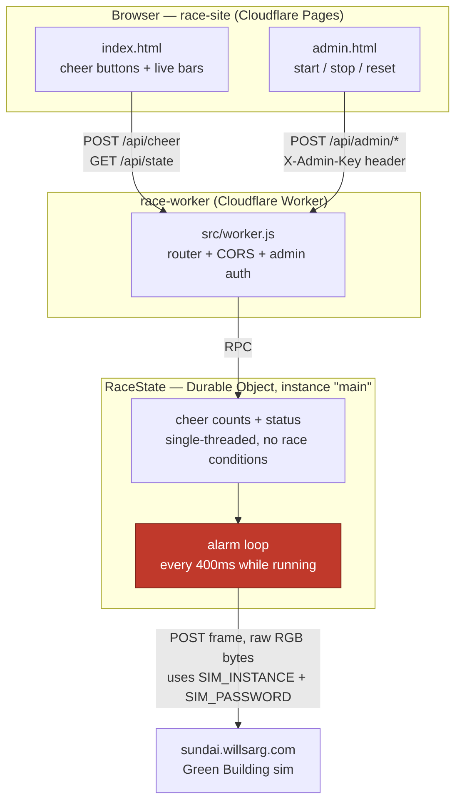

# Green Building Race — Worker

Backend for the mascot race: 4 schools (MIT, Harvard, BU, Northeastern), the crowd cheers
for one via the [race-site](../race-site) frontend, cheers move that school's lane, first
to fill all 9 columns wins. A Durable Object holds the authoritative race state and, on a
timer, renders it to a 17x9 frame and pushes it straight to the Green Building sim — the
sim instance name / event password never reach the browser.

## Why Durable Objects (not R2/KV/D1)

The race needs one strongly-consistent counter set that many concurrent cheer requests
mutate, plus a timer loop that repaints the building. That's exactly what a Durable Object
is for: single-threaded per-instance execution (no race conditions on the cheer counts),
built-in transactional storage, and alarms for the repaint loop — all in one primitive.
R2 is for blobs, KV is eventually consistent (bad for a live counter), D1 would work but is
overkill for one small piece of state. This app uses exactly one DO instance (`"main"`).

## Architecture



`SIM_INSTANCE` and `SIM_PASSWORD` (red node above) exist only as Worker secrets — set via
`wrangler secret put`, read only inside the Durable Object, never returned in any API
response or shipped to the browser.

- `src/worker.js` — HTTP router + CORS + admin auth
- `src/race-state.js` — the `RaceState` Durable Object: cheer counts, start/stop/reset,
  the alarm loop that pushes frames, and `rotateInstance()` to mint a fresh sim instance
- `src/render.js` — race state -> 17x9 pixel frame (solid lane bars; swap this out for
  fancier mascot animation without touching the game logic)
- `src/mascots.js` — school names/colors, ported from the `mascots` branch

## Setup

```bash
npm install
```

## Local dev

Copy `.dev.vars.example` to `.dev.vars` and fill in real values (never commit `.dev.vars`):

```
SIM_INSTANCE=<a sim instance name you already have>
SIM_PASSWORD=<the event password>
ADMIN_KEY=<pick any string for local testing>
```

```bash
npx wrangler dev
```

## Deploy

```bash
npx wrangler login        # one-time, opens a browser
npx wrangler secret put SIM_INSTANCE
npx wrangler secret put SIM_PASSWORD
npx wrangler secret put ADMIN_KEY
npx wrangler deploy
```

`wrangler deploy` prints the Worker's URL (`https://green-building-race.<subdomain>.workers.dev`)
— put that in `race-site/config.js` as `API_BASE`, then deploy the Pages site.

## API

| Method | Path | Auth | Body / notes |
| --- | --- | --- | --- |
| GET | `/api/state` | none | current race state + per-school progress (0..8) |
| POST | `/api/cheer` | none, rate-limited per IP+school | `{"school": "mit"\|"harvard"\|"bu"\|"neu"}` |
| POST | `/api/admin/start` | `X-Admin-Key` header | resets cheers, sets status `running` |
| POST | `/api/admin/stop` | `X-Admin-Key` header | pauses (status -> `idle`), cancels the alarm |
| POST | `/api/admin/reset` | `X-Admin-Key` header | full wipe, dims the building |
| POST | `/api/admin/rotate-instance` | `X-Admin-Key` header | mints a new sim instance with `SIM_PASSWORD`, adopts it |

## Tuning

`src/race-state.js`: `CHEERS_PER_COLUMN` (crowd size vs. race length — lower it for a
smaller crowd), `ALARM_INTERVAL_MS` (how often the building repaints while running).
